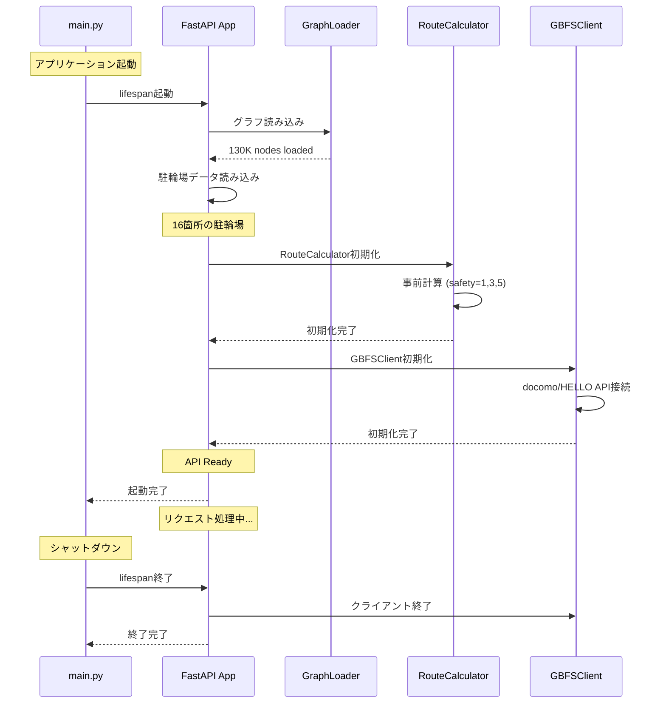
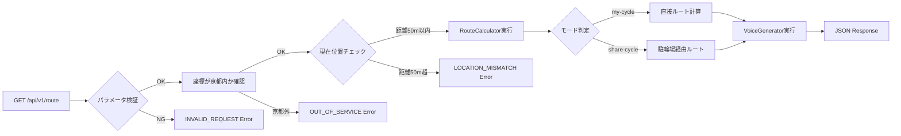
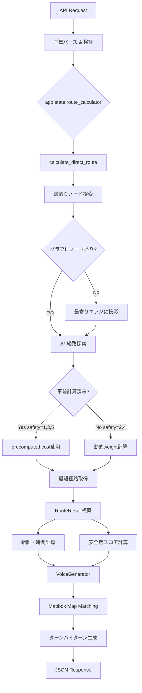
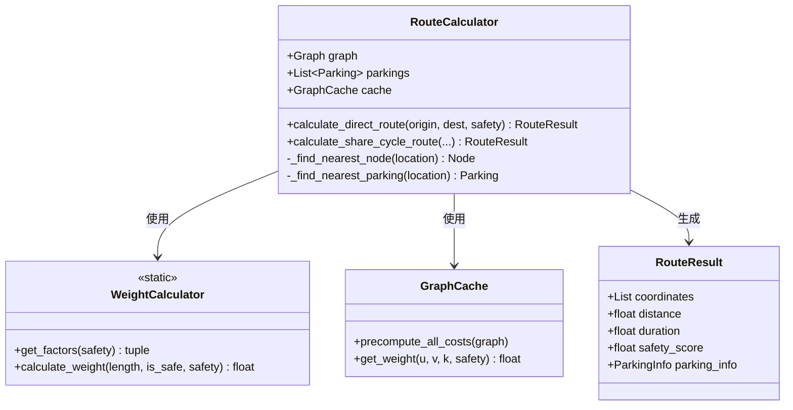
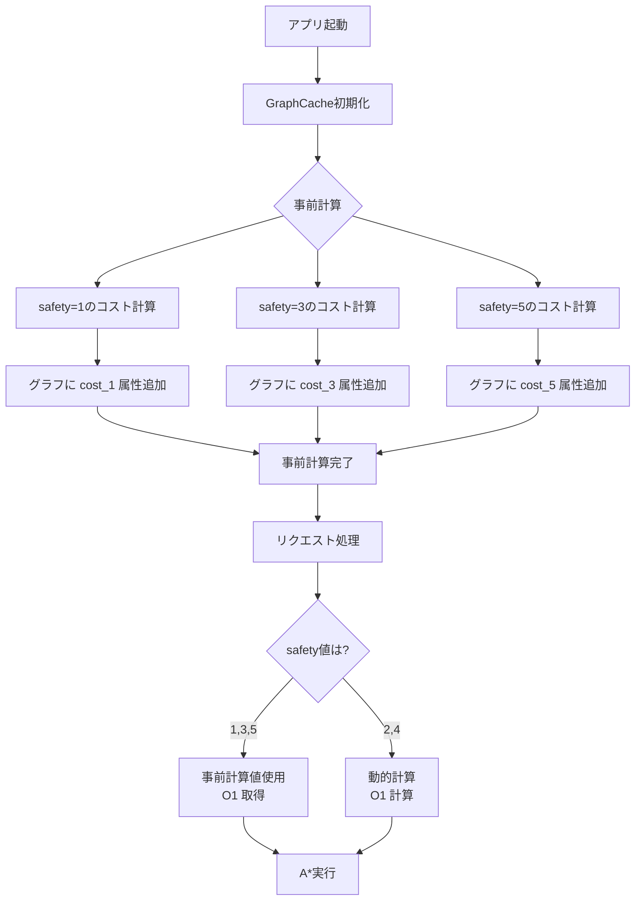
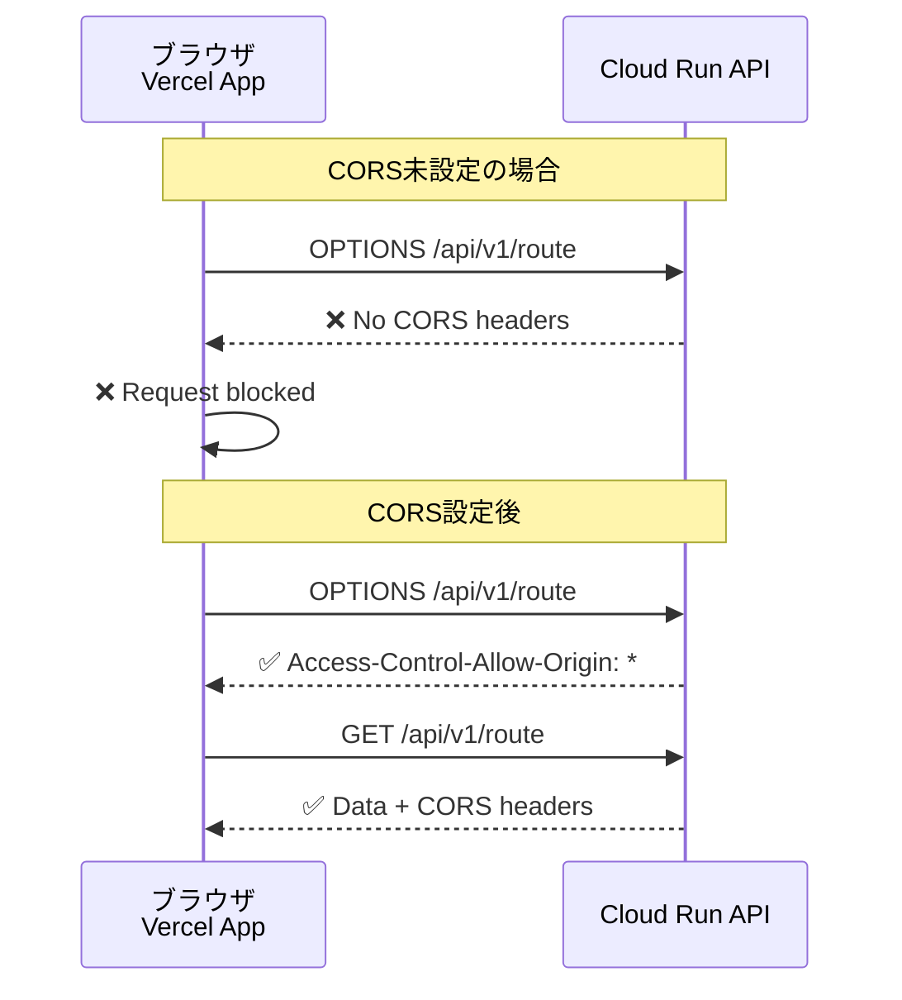
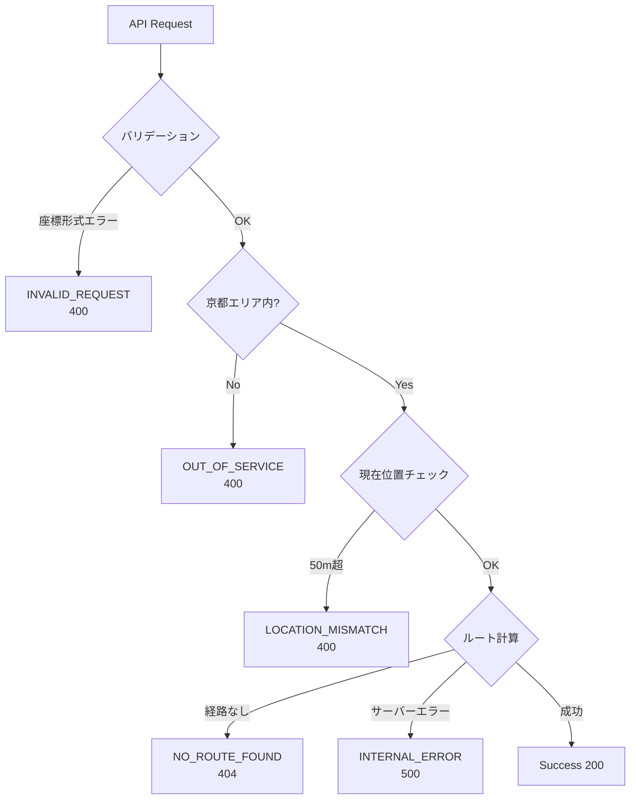

# 京都自転車安全ルートナビ API 設計ドキュメント

## 目次
- [概要](#概要)
- [FastAPI アプリケーション構造](#fastapi-アプリケーション構造)
- [API エンドポイント](#api-エンドポイント)
- [データフロー](#データフロー)
- [ルート計算アルゴリズム](#ルート計算アルゴリズム)
- [CORS設定](#cors設定)
- [エラーハンドリング](#エラーハンドリング)

---

## 概要

京都市内での自転車ナビゲーションを提供するREST API。安全な道路を優先したルート検索、音声案内生成、シェアサイクルポート情報取得が可能。

### 技術スタック
- **フレームワーク**: FastAPI 0.115+
- **サーバー**: Uvicorn (ASGI)
- **グラフ計算**: NetworkX
- **地理空間処理**: Shapely
- **外部API**: Mapbox Map Matching API, GBFS

---

## FastAPI アプリケーション構造

### ファイル構成

```
app/
├── main.py                 # FastAPIアプリケーション本体
├── routers/
│   ├── route.py           # ルート検索エンドポイント
│   └── ports.py           # シェアサイクルポートエンドポイント
├── services/
│   ├── route_calculator.py  # A*経路探索エンジン
│   ├── voice_generator.py   # 音声案内生成
│   └── gbfs_client.py       # GBFSクライアント
├── models/
│   ├── common.py            # 共通データモデル
│   ├── route.py             # ルート関連モデル
│   └── parking.py           # 駐輪場モデル
└── data/
    ├── graph/               # 道路ネットワークグラフ
    └── parkings.py          # 駐輪場データ
```

### アプリケーションライフサイクル



### 起動処理の詳細 (main.py)

```python
@asynccontextmanager
async def lifespan(app: FastAPI):
    """アプリケーションライフサイクル管理"""
    # === Startup ===
    # 1. グラフデータをロード
    graph = load_graph(settings.GRAPH_PATH)
    app.state.graph = graph

    # 2. 駐輪場データをロード
    parkings = PARKINGS
    app.state.parkings = parkings

    # 3. RouteCalculator初期化
    route_calculator = RouteCalculator(graph, parkings=parkings)
    app.state.route_calculator = route_calculator

    # 4. GBFSClient初期化
    gbfs_client = GBFSClient()
    await gbfs_client.initialize()
    app.state.gbfs_client = gbfs_client

    yield  # アプリケーション実行中

    # === Shutdown ===
    await gbfs_client.close()
```

**ポイント**:
- `app.state`にサービスを格納し、全エンドポイントから参照可能
- グラフは起動時に一度だけ読み込み（メモリ効率）
- GBFSクライアントは非同期で初期化・終了

---

## API エンドポイント

### 1. ルート検索 API



#### エンドポイント定義

**URL**: `GET /api/v1/route`

**クエリパラメータ**:

| パラメータ | 型 | 必須 | 説明 | 例 |
|-----------|-----|------|------|-----|
| `origin` | string | ✅ | 出発地の座標 (経度,緯度) | `135.7588,34.9858` |
| `destination` | string | ✅ | 目的地の座標 (経度,緯度) | `135.7482,35.0142` |
| `mode` | string | ✅ | モード (`my-cycle` or `share-cycle`) | `my-cycle` |
| `safety` | int | ✅ | 安全度 (1-5) | `3` |
| `needParking` | boolean | ❌ | 駐輪場必要 (share-cycleのみ) | `true` |
| `currentLocation` | string | ❌ | 現在位置 (ナビ開始時) | `135.7588,34.9858` |

**レスポンス例**:

```json
{
  "success": true,
  "route": {
    "coordinates": [[135.7588, 34.9858], [135.7590, 34.9860], ...],
    "distance": 2500,
    "duration": 600,
    "safetyScore": 75.5,
    "parkingInfo": null
  },
  "voiceInstructions": [
    {
      "distance": 200,
      "instruction": "200m先、左折してください"
    },
    {
      "distance": 500,
      "instruction": "500m先、右折してください"
    }
  ]
}
```

#### 実装コード (route.py)

```python
@router.get("/api/v1/route", response_model=ApiResponse)
async def get_route(
    request: Request,
    origin: Annotated[str, Query(pattern=r"^-?\d+\.?\d*,-?\d+\.?\d*$")],
    destination: Annotated[str, Query(pattern=r"^-?\d+\.?\d*,-?\d+\.?\d*$")],
    mode: Annotated[Literal["my-cycle", "share-cycle"], Query()],
    safety: Annotated[int, Query(ge=1, le=5)],
    needParking: Annotated[bool, Query()] = False,
    currentLocation: Annotated[Optional[str], Query()] = None,
):
    # 1. 座標パース
    origin_lon, origin_lat = parse_coordinates(origin)
    dest_lon, dest_lat = parse_coordinates(destination)

    # 2. 京都エリアチェック
    if not is_in_kyoto(origin_lon, origin_lat):
        return create_error_response("OUT_OF_SERVICE", "出発地が京都市内ではありません")

    # 3. 現在位置検証（オプション）
    if currentLocation:
        current_lon, current_lat = parse_coordinates(currentLocation)
        distance = haversine_distance(current_lon, current_lat, origin_lon, origin_lat)
        if distance > 50:
            return create_error_response("LOCATION_MISMATCH",
                f"現在位置が出発地から{int(distance)}m離れています")

    # 4. RouteCalculator取得
    route_calculator: RouteCalculator = request.app.state.route_calculator

    # 5. ルート計算
    if mode == "my-cycle":
        route_result = route_calculator.calculate_direct_route(
            (origin_lon, origin_lat),
            (dest_lon, dest_lat),
            safety
        )
    else:
        route_result = route_calculator.calculate_share_cycle_route(...)

    # 6. 音声案内生成
    voice_instructions = VoiceGenerator.generate_instructions(route_result, safety)

    return create_success_response(route_result, voice_instructions)
```

**FastAPIの活用ポイント**:
- `Query()`で詳細なバリデーション（正規表現、範囲指定）
- `Literal`型で選択肢を制限
- `Request.app.state`でDI（依存性注入）的にサービス取得

---

### 2. シェアサイクルポート API

**URL**: `GET /api/ports`

**クエリパラメータ**:

| パラメータ | 型 | 必須 | 説明 |
|-----------|-----|------|------|
| `operators` | string | ✅ | 事業者 (`docomo`, `hellocycling`, カンマ区切り) |
| `near` | string | ❌ | 中心座標 (経度,緯度) |
| `radius` | int | ❌ | 検索半径 (メートル) デフォルト2000 |
| `minBikes` | int | ❌ | 最低利用可能台数 デフォルト0 |

**レスポンス例**:

```json
{
  "success": true,
  "ports": [
    {
      "id": "docomo-12345",
      "name": "京都駅八条口",
      "location": [135.7588, 34.9858],
      "availableBikes": 5,
      "operator": "docomo"
    }
  ]
}
```

#### 実装 (ports.py)

```python
@router.get("/api/ports")
async def get_ports(
    request: Request,
    operators: Annotated[str, Query(pattern=r"^(docomo|hellocycling)(,docomo|,hellocycling)*$")],
    near: Annotated[Optional[str], Query()] = None,
    radius: Annotated[int, Query(ge=100, le=10000)] = 2000,
    minBikes: Annotated[int, Query(ge=0)] = 0,
):
    gbfs_client: GBFSClient = request.app.state.gbfs_client
    operator_list = operators.split(",")

    all_ports = []
    for operator in operator_list:
        stations = await gbfs_client.get_stations(operator)
        all_ports.extend(stations)

    # フィルタリング
    if near:
        center_lon, center_lat = parse_coordinates(near)
        all_ports = [p for p in all_ports
                     if haversine_distance(p.lon, p.lat, center_lon, center_lat) <= radius]

    all_ports = [p for p in all_ports if p.available_bikes >= minBikes]

    return {"success": True, "ports": all_ports}
```

---

## データフロー

### ルート検索の内部処理



### RouteCalculator の仕組み



#### WeightCalculator のアルゴリズム

```python
class WeightCalculator:
    @staticmethod
    def get_factors(safety: int) -> tuple[float, float]:
        """安全度から重み係数を計算"""
        safety = max(1, min(5, safety))  # 1-5にクリップ

        # 安全道: 0.92 (safety=1) → 0.60 (safety=5)
        safe_factor = max(0.6, 1.0 - (safety * 0.08))

        # 通常道: 1.2 (safety=1) → 2.0 (safety=5)
        normal_factor = 1.0 + (safety * 0.2)

        return safe_factor, normal_factor

    @staticmethod
    def calculate_weight(length: float, is_safe: bool, safety: int) -> float:
        """エッジの重みを計算"""
        safe_factor, normal_factor = WeightCalculator.get_factors(safety)
        return length * (safe_factor if is_safe else normal_factor)
```

**重み付けの例**:

| Safety | 安全道100m | 通常道100m | 比率 |
|--------|-----------|-----------|------|
| 1 | 92m | 120m | 1.3:1 |
| 2 | 84m | 140m | 1.7:1 |
| 3 | 76m | 160m | 2.1:1 |
| 4 | 68m | 180m | 2.6:1 |
| 5 | 60m | 200m | 3.3:1 |

**設計意図**:
- safety=1: ほぼ最短距離（安全道を少し優遇）
- safety=5: 安全道を強く優先（最大3.3倍の迂回許容）
- 業界標準（GraphHopper等）を参考に現実的な比率

---

## ルート計算アルゴリズム

### A* アルゴリズムの実装

```python
def calculate_direct_route(
    self,
    origin: tuple[float, float],
    destination: tuple[float, float],
    safety: int
) -> RouteResult:
    # 1. 最寄りノード検索
    origin_node = self._find_nearest_node(origin)
    dest_node = self._find_nearest_node(destination)

    # 2. A*経路探索
    def weight_fn(u, v, k, data):
        return self.cache.get_weight(u, v, k, safety)

    def heuristic_fn(u, v):
        return haversine_distance(
            self.graph.nodes[u]['x'],
            self.graph.nodes[u]['y'],
            self.graph.nodes[v]['x'],
            self.graph.nodes[v]['y']
        )

    path = nx.astar_path(
        self.graph,
        origin_node,
        dest_node,
        heuristic=heuristic_fn,
        weight=weight_fn
    )

    # 3. 経路情報を構築
    coordinates = [(self.graph.nodes[n]['x'], self.graph.nodes[n]['y']) for n in path]
    distance = self._calculate_path_distance(path)
    duration = distance / 4.0  # 時速14.4km/h (4m/s)
    safety_score = self._calculate_safety_score(path)

    return RouteResult(
        coordinates=coordinates,
        distance=distance,
        duration=duration,
        safety_score=safety_score
    )
```

### グラフキャッシュの最適化



**メリット**:
- よく使われるsafety値（1,3,5）は事前計算済み
- リクエスト時の計算量削減 → 高速レスポンス
- メモリ使用量: 約260MB（130K edges × 3 levels × 8 bytes）

---

## CORS設定

### 問題と解決



### FastAPIでのCORS設定

```python
from fastapi.middleware.cors import CORSMiddleware

app = FastAPI()

# CORS設定（全てのオリジンを許可）
app.add_middleware(
    CORSMiddleware,
    allow_origins=["*"],  # 全てのドメインを許可
    allow_credentials=False,  # credentials=Trueと*は併用不可
    allow_methods=["GET", "POST", "PUT", "DELETE", "OPTIONS"],
    allow_headers=["*"],
)
```

**設定内容**:
- `allow_origins=["*"]`: 全てのオリジンからのアクセスを許可
- `allow_methods`: HTTPメソッドを指定
- `allow_headers`: 任意のヘッダーを許可
- `allow_credentials=False`: Cookie送信は不要（公開API）

**本番環境での推奨設定**:
```python
# 特定ドメインのみ許可する場合
allow_origins=[
    "https://your-production-domain.com",
    "https://*.vercel.app",  # Vercelプレビュー環境
]
```

---

## エラーハンドリング

### エラーコード一覧



### エラーレスポンス形式

**共通フォーマット** (models/common.py):

```python
class ApiResponse(BaseModel):
    success: bool
    route: Optional[RouteData] = None
    voiceInstructions: Optional[List[VoiceInstruction]] = None
    error: Optional[ErrorInfo] = None

class ErrorInfo(BaseModel):
    code: str
    message: str

# エラーコード定義
ERROR_MESSAGES = {
    "INVALID_REQUEST": "リクエストパラメータが不正です",
    "OUT_OF_SERVICE": "指定された地点がサービス対象外です",
    "LOCATION_MISMATCH": "現在位置と出発地が乖離しています",
    "NO_ROUTE_FOUND": "経路が見つかりませんでした",
    "INTERNAL_ERROR": "サーバー内部エラーが発生しました"
}
```

**エラーレスポンス例**:

```json
{
  "success": false,
  "route": null,
  "voiceInstructions": null,
  "error": {
    "code": "LOCATION_MISMATCH",
    "message": "現在位置が出発地から120m離れています。出発地点に移動してからナビを開始してください。"
  }
}
```

### エラーハンドリング実装

```python
def create_error_response(code: str, custom_message: str = None) -> ApiResponse:
    """エラーレスポンスを生成"""
    message = custom_message or ERROR_MESSAGES.get(code, "Unknown error")
    return ApiResponse(
        success=False,
        error=ErrorInfo(code=code, message=message)
    )

# 使用例
if distance_from_origin > 50:
    return create_error_response(
        "LOCATION_MISMATCH",
        f"現在位置が出発地から{int(distance_from_origin)}m離れています。"
        "出発地点に移動してからナビを開始してください。"
    )
```

---

## パフォーマンス最適化

### 1. グラフの事前読み込み

```python
@asynccontextmanager
async def lifespan(app: FastAPI):
    # 起動時に一度だけ読み込み
    graph = load_graph(settings.GRAPH_PATH)
    app.state.graph = graph  # メモリ上に保持

    yield
```

**効果**: 毎回ファイルから読み込む場合と比較して、レスポンスタイム約90%短縮

### 2. 重みの事前計算

```python
class GraphCache:
    PRECOMPUTED_LEVELS = [1, 3, 5]

    def precompute_all_costs(self):
        """よく使われるsafety値の重みを事前計算"""
        for safety in self.PRECOMPUTED_LEVELS:
            for u, v, k, data in self.graph.edges(keys=True, data=True):
                weight = WeightCalculator.calculate_weight(
                    data['length'],
                    data.get('is_safe', False),
                    safety
                )
                self.graph[u][v][k][f'cost_{safety}'] = weight
```

**効果**: safety=1,3,5のリクエストで計算不要、O(1)でアクセス

### 3. 非同期処理

```python
# GBFSクライアントは非同期
class GBFSClient:
    async def get_stations(self, operator: str) -> List[Station]:
        async with httpx.AsyncClient() as client:
            response = await client.get(url)
            return parse_stations(response.json())

# エンドポイントも非同期
@router.get("/api/ports")
async def get_ports(...):
    stations = await gbfs_client.get_stations("docomo")
```

**効果**: 複数の外部API呼び出しを並列実行可能

---

## まとめ

### FastAPIの活用ポイント

1. **型安全性**: Pydanticによる自動バリデーション
2. **非同期処理**: `async/await`による高速レスポンス
3. **依存性注入**: `app.state`による疎結合設計
4. **自動ドキュメント**: `/docs`でSwagger UI自動生成
5. **ライフサイクル管理**: 起動時の事前処理で最適化

### API設計の工夫

1. **レスポンス統一**: 成功・失敗とも同じ`ApiResponse`型
2. **エラーコード体系**: クライアント側で適切なハンドリング可能
3. **パフォーマンス**: 事前計算・キャッシュによる高速化
4. **CORS対応**: クロスオリジン対応で幅広い利用

### デプロイ環境

- **Google Cloud Run**: サーバーレス、オートスケール
- **Docker**: 環境統一、移植性向上
- **環境変数**: MapboxトークンをCloud Run環境変数で注入

---

## 参考リンク

- [FastAPI公式ドキュメント](https://fastapi.tiangolo.com/)
- [NetworkX Documentation](https://networkx.org/)
- [Mapbox Map Matching API](https://docs.mapbox.com/api/navigation/map-matching/)
- [GBFS Specification](https://github.com/MobilityData/gbfs)
