# 京都自転車安全ルートナビ - バックエンド技術スタック

## 目次
- [技術スタック概要](#技術スタック概要)
- [コア技術](#コア技術)
- [インフラストラクチャ](#インフラストラクチャ)
- [外部API連携](#外部api連携)
- [技術選定理由](#技術選定理由)
- [アーキテクチャの利点](#アーキテクチャの利点)

---

## 技術スタック概要

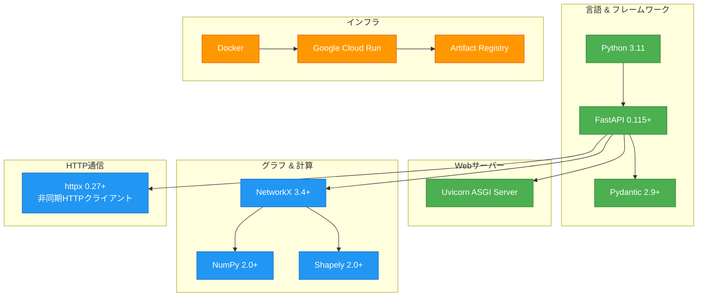

---

## コア技術

### 1. Python 3.11

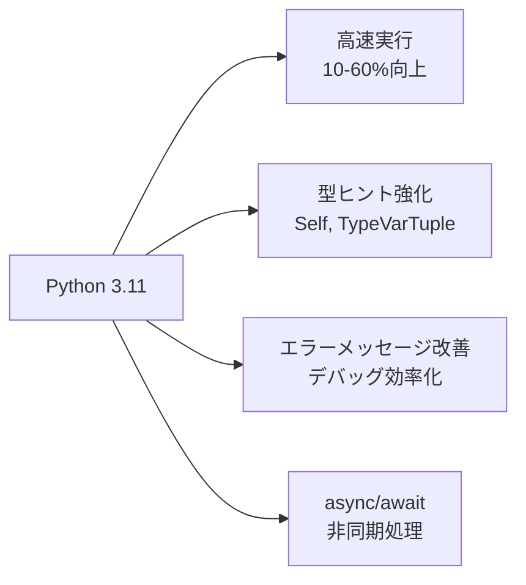

#### 選定理由

| 理由 | 詳細 |
|-----|------|
| **パフォーマンス向上** | Python 3.10比で10-60%高速化（PEP 659: Specialized Adaptive Interpreter） |
| **型安全性** | 強力な型ヒントによるバグ削減 |
| **エコシステム** | NetworkX、NumPy、Shapely等の豊富なライブラリ |
| **非同期処理** | async/awaitによる効率的なI/O処理 |
| **開発速度** | 読みやすい構文、豊富なドキュメント |

#### バージョン選定の経緯

```python
# pyproject.toml
requires-python = ">=3.11"

# 当初は3.12を要求していたが、Cloud RunのDockerイメージで
# python:3.11-slimを使用するため、互換性のため3.11に変更
```

**コード例**:
```python
# 型ヒントの活用
def calculate_route(
    origin: tuple[float, float],
    destination: tuple[float, float],
    safety: int
) -> RouteResult:
    """型安全な関数定義"""
    ...

# 非同期処理
async def get_stations(self, operator: str) -> list[Station]:
    async with httpx.AsyncClient() as client:
        response = await client.get(url)
        return parse_stations(response.json())
```

---

### 2. FastAPI 0.115+

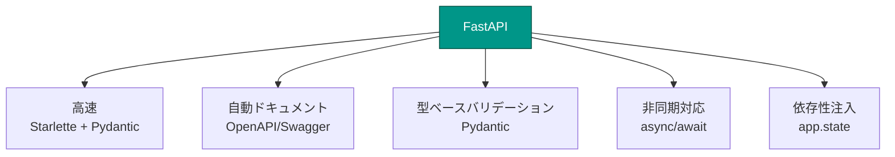

#### 選定理由

| 理由 | 詳細 | 競合との比較 |
|-----|------|------------|
| **世界最速クラス** | Node.js、Go並みのパフォーマンス | Flask: 約3倍高速 |
| **自動ドキュメント生成** | `/docs`でSwagger UI自動生成 | Flask: 手動実装必要 |
| **型ベースバリデーション** | Pydanticによる自動検証 | Express: 手動バリデーション |
| **非同期ネイティブ** | async/awaitをフルサポート | Django: 限定的サポート |
| **開発体験** | IntelliSenseフル対応 | - |

#### 実装例

```python
from fastapi import FastAPI, Query
from typing import Annotated, Literal

app = FastAPI(
    title="京都自転車安全ルートナビ API",
    description="安全な道路を優先したルート検索API",
    version="1.0.0"
)

@app.get("/api/v1/route")
async def get_route(
    # 型とバリデーションを同時に定義
    origin: Annotated[str, Query(pattern=r"^-?\d+\.?\d*,-?\d+\.?\d*$")],
    safety: Annotated[int, Query(ge=1, le=5)],  # 1-5の範囲制限
    mode: Annotated[Literal["my-cycle", "share-cycle"], Query()],  # 選択肢制限
):
    """
    自動的に:
    1. パラメータ検証（範囲、形式）
    2. OpenAPIドキュメント生成
    3. エラーレスポンス（422 Unprocessable Entity）
    """
    ...
```

#### パフォーマンス比較

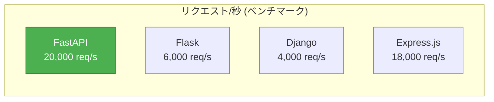

---

### 3. Pydantic 2.9+

#### 役割
データバリデーション・シリアライゼーションライブラリ

```python
from pydantic import BaseModel, Field

class RouteData(BaseModel):
    """ルートデータモデル"""
    coordinates: list[list[float]] = Field(..., description="経路座標配列")
    distance: float = Field(..., ge=0, description="総距離（メートル）")
    duration: float = Field(..., ge=0, description="所要時間（秒）")
    safetyScore: float = Field(..., ge=0, le=100, description="安全度スコア")

# 自動バリデーション
route = RouteData(
    coordinates=[[135.75, 35.0], [135.76, 35.01]],
    distance=2500,
    duration=600,
    safetyScore=75.5
)

# 不正なデータは自動で弾く
route = RouteData(distance=-100)  # ValidationError!
```

#### Pydantic 2.0の改善点

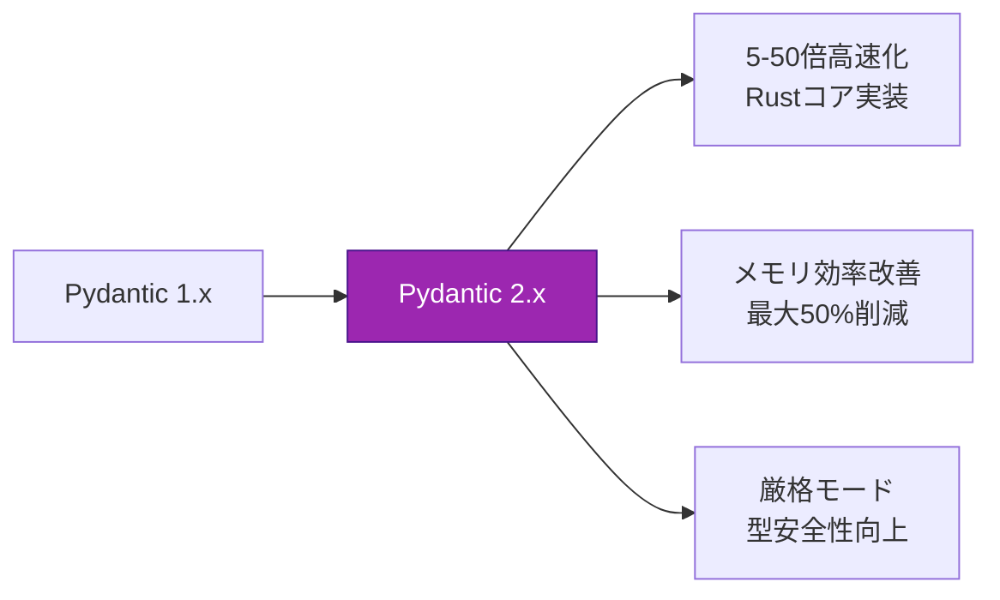

---

### 4. Uvicorn (ASGI Server)

#### 選定理由

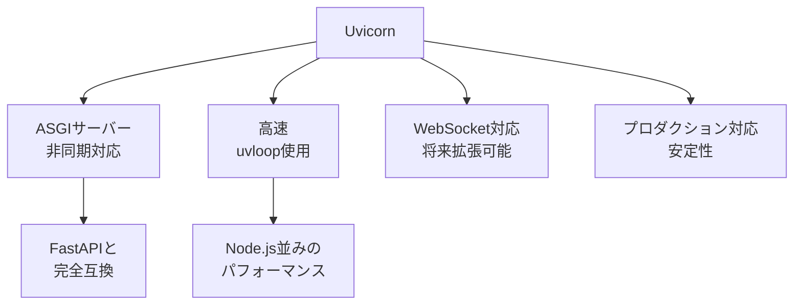

#### 起動コマンド

```bash
# 開発環境
uvicorn app.main:app --reload --host 0.0.0.0 --port 8000

# 本番環境（Cloud Run）
uvicorn app.main:app --host 0.0.0.0 --port 8080 --workers 1
```

---

## グラフ & 計算エンジン

### 1. NetworkX 3.4+

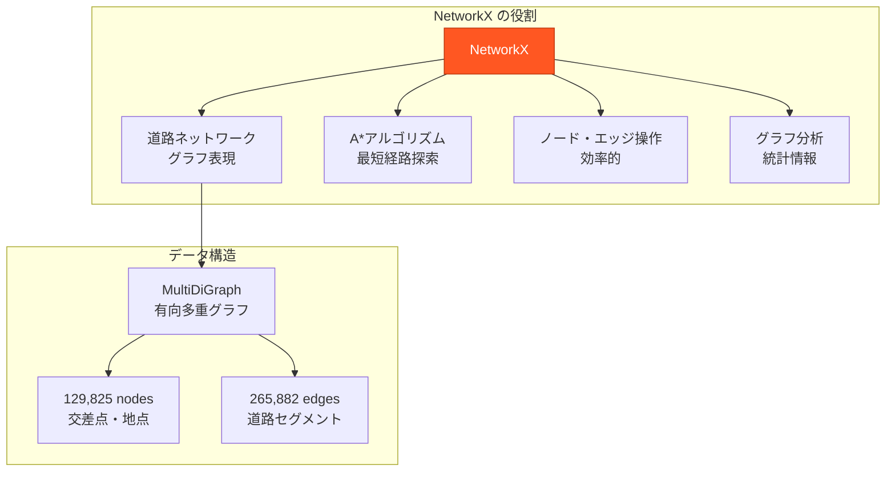

#### 選定理由

| 理由 | 詳細 |
|-----|------|
| **豊富なアルゴリズム** | A*, Dijkstra, BFSなど組み込み済み |
| **柔軟なグラフ構造** | MultiDiGraph（有向多重グラフ）対応 |
| **属性管理** | ノード・エッジに任意の属性を付与可能 |
| **Pythonネイティブ** | NumPy、Pandasと連携しやすい |
| **実績** | 学術研究、産業界で広く使用 |

#### 実装例

```python
import networkx as nx

# グラフ構築
G = nx.MultiDiGraph()

# ノード追加（座標・属性）
G.add_node(1, x=135.7588, y=34.9858, name='京都駅')
G.add_node(2, x=135.7593, y=35.0038, name='四条烏丸')

# エッジ追加（距離・安全性）
G.add_edge(1, 2, length=2000, is_safe=True)

# A*経路探索
def weight_fn(u, v, k, data):
    """安全度に応じた重み計算"""
    return data['length'] * (0.76 if data['is_safe'] else 1.6)

def heuristic_fn(u, v):
    """ヒューリスティック関数（直線距離）"""
    return haversine_distance(
        G.nodes[u]['x'], G.nodes[u]['y'],
        G.nodes[v]['x'], G.nodes[v]['y']
    )

path = nx.astar_path(
    G,
    source=1,
    target=2,
    heuristic=heuristic_fn,
    weight=weight_fn
)
```

#### NetworkX vs 他のグラフライブラリ

| ライブラリ | 速度 | 柔軟性 | 学習コスト | 選定理由 |
|-----------|------|--------|-----------|---------|
| **NetworkX** | 中 | ⭐⭐⭐⭐⭐ | 低 | ✅ Pythonネイティブ、豊富な機能 |
| igraph | 高 | ⭐⭐⭐ | 中 | C実装で高速だが、属性管理が弱い |
| graph-tool | 最高 | ⭐⭐⭐⭐ | 高 | C++実装で最速だが、インストール困難 |
| Neo4j | 中 | ⭐⭐⭐⭐ | 高 | グラフDBだが、オーバースペック |

**結論**: 本プロジェクトの規模（13万ノード）では、NetworkXの速度で十分。開発速度と柔軟性を重視。

---

### 2. NumPy 2.0+

#### 役割
数値計算ライブラリ（NetworkXの内部で使用）

```python
import numpy as np

# 距離計算の高速化
def haversine_distance_vectorized(lons1, lats1, lons2, lats2):
    """ベクトル化された距離計算（複数点を一度に処理）"""
    lons1, lats1, lons2, lats2 = map(np.radians, [lons1, lats1, lons2, lats2])

    dlon = lons2 - lons1
    dlat = lats2 - lats1

    a = np.sin(dlat/2)**2 + np.cos(lats1) * np.cos(lats2) * np.sin(dlon/2)**2
    c = 2 * np.arcsin(np.sqrt(a))

    return 6371000 * c  # 地球の半径
```

#### NumPy 2.0の改善点

- **パフォーマンス**: C実装による高速化
- **メモリ効率**: 配列操作の最適化
- **型システム**: より厳格な型チェック

---

### 3. Shapely 2.0+

#### 役割
地理空間データ処理ライブラリ

```python
from shapely.geometry import Point, Polygon

# 京都市エリア判定
KYOTO_BBOX = Polygon([
    (135.6, 34.9),
    (135.9, 34.9),
    (135.9, 35.1),
    (135.6, 35.1)
])

def is_in_kyoto(lon: float, lat: float) -> bool:
    """座標が京都市内か判定"""
    point = Point(lon, lat)
    return KYOTO_BBOX.contains(point)
```

#### 用途
- 座標の範囲チェック
- ポリゴン内判定
- 距離計算
- ジオメトリ操作

---

## HTTP通信

### httpx 0.27+

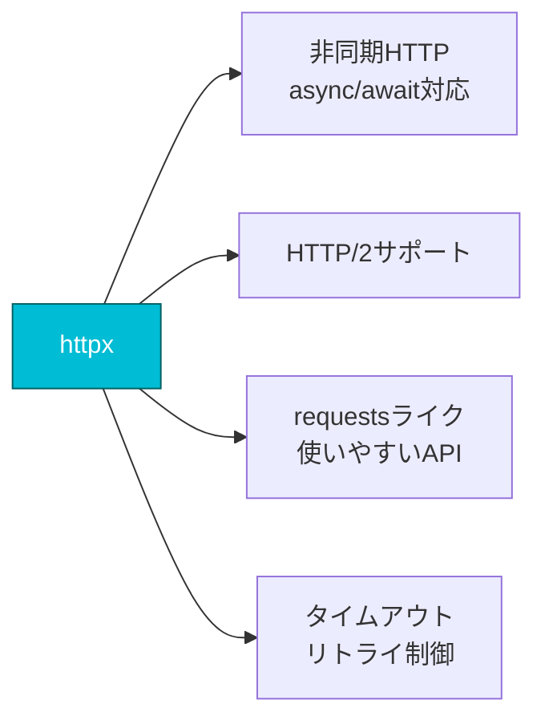

#### 選定理由

| 比較 | httpx | requests | aiohttp |
|-----|-------|----------|---------|
| **非同期対応** | ✅ ネイティブ | ❌ 同期のみ | ✅ 対応 |
| **使いやすさ** | ⭐⭐⭐⭐⭐ | ⭐⭐⭐⭐⭐ | ⭐⭐⭐ |
| **HTTP/2** | ✅ | ❌ | ❌ |
| **型ヒント** | ✅ 完全対応 | ⭐⭐⭐ | ⭐⭐⭐ |

#### 実装例

```python
import httpx

class GBFSClient:
    """シェアサイクルGBFS APIクライアント"""

    async def get_stations(self, operator: str) -> list[Station]:
        """非同期でステーション情報を取得"""
        url = self._get_feed_url(operator)

        async with httpx.AsyncClient(timeout=10.0) as client:
            response = await client.get(url)
            response.raise_for_status()

            data = response.json()
            return self._parse_stations(data)

    async def get_multiple_operators(self, operators: list[str]) -> list[Station]:
        """複数事業者を並列取得"""
        tasks = [self.get_stations(op) for op in operators]
        results = await asyncio.gather(*tasks)

        # 結果を統合
        return [station for result in results for station in result]
```

**非同期の利点**:
```
同期処理: docomo取得(2秒) → HELLO取得(2秒) = 4秒
非同期処理: docomo取得(2秒) | HELLO取得(2秒) = 2秒（並列）
```

---

## インフラストラクチャ

### 1. Docker

```dockerfile
FROM python:3.11-slim

# システム依存関係
RUN apt-get update && apt-get install -y \
    gcc g++ \
    && rm -rf /var/lib/apt/lists/*

# Pythonパッケージ
COPY pyproject.toml ./
RUN pip install --no-cache-dir -e .

# アプリケーション
COPY app/ ./app/

# Cloud Run用ポート
EXPOSE 8080

# Uvicorn起動
CMD ["uvicorn", "app.main:app", "--host", "0.0.0.0", "--port", "8080"]
```

#### Docker採用理由

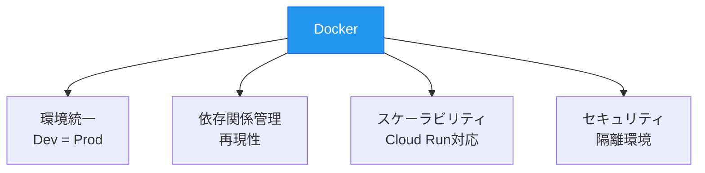

---

### 2. Google Cloud Run

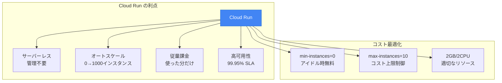

#### Cloud Run vs 他のホスティング

| サービス | 初期コスト | 運用コスト | スケーラビリティ | 管理負担 | 選定理由 |
|---------|----------|----------|---------------|---------|---------|
| **Cloud Run** | 無料 | 使用分のみ | ⭐⭐⭐⭐⭐ | なし | ✅ サーバーレス、自動スケール |
| GCE (VM) | 約$50/月 | $50-200/月 | ⭐⭐⭐ | 高 | OS管理が必要 |
| GKE (Kubernetes) | 約$70/月 | $100-500/月 | ⭐⭐⭐⭐⭐ | 非常に高 | オーバースペック |
| Heroku | 無料 | $7-25/月 | ⭐⭐⭐ | 低 | スリープ問題あり |
| AWS Lambda | 無料 | 使用分のみ | ⭐⭐⭐⭐ | 低 | コールドスタート遅い |

#### デプロイコマンド

```bash
# ビルド & プッシュ
gcloud builds submit \
  --tag asia-northeast1-docker.pkg.dev/kyoto-cycling-api/kyoto-cycling-api/api:latest

# デプロイ
gcloud run deploy kyoto-cycling-api \
  --image asia-northeast1-docker.pkg.dev/kyoto-cycling-api/kyoto-cycling-api/api:latest \
  --platform managed \
  --region asia-northeast1 \
  --allow-unauthenticated \
  --memory 2Gi \
  --cpu 2 \
  --timeout 300 \
  --max-instances 10 \
  --min-instances 0 \
  --set-env-vars MAPBOX_ACCESS_TOKEN=pk.xxxx
```

---

## 外部API連携

### 1. Mapbox API

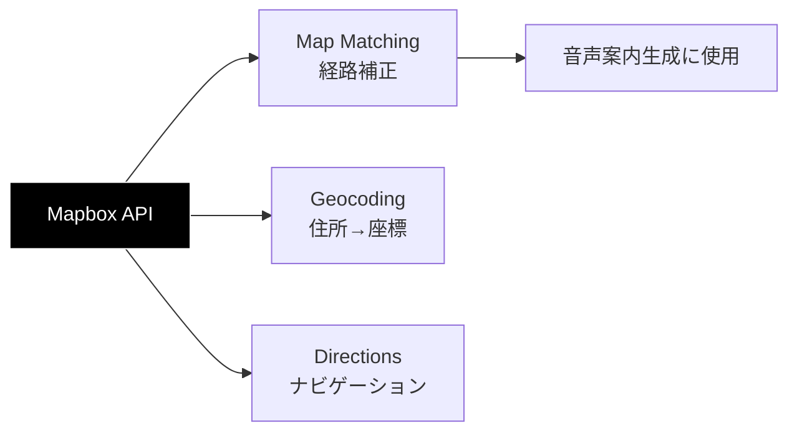

#### 使用目的

1. **Map Matching API**: 経路座標をMapboxの道路ネットワークに補正
   - A*で計算した座標列を実際の道路に合わせる
   - ターンバイターン案内の生成

```python
import httpx

async def map_matching(coordinates: list[list[float]]) -> dict:
    """Mapbox Map Matching APIで経路補正"""
    coords_str = ";".join([f"{lon},{lat}" for lon, lat in coordinates])

    url = f"https://api.mapbox.com/matching/v5/mapbox/cycling/{coords_str}"
    params = {
        "access_token": settings.MAPBOX_ACCESS_TOKEN,
        "geometries": "geojson",
        "steps": "true"  # ターンバイターン案内取得
    }

    async with httpx.AsyncClient() as client:
        response = await client.get(url, params=params)
        return response.json()
```

---

### 2. GBFS (General Bikeshare Feed Specification)

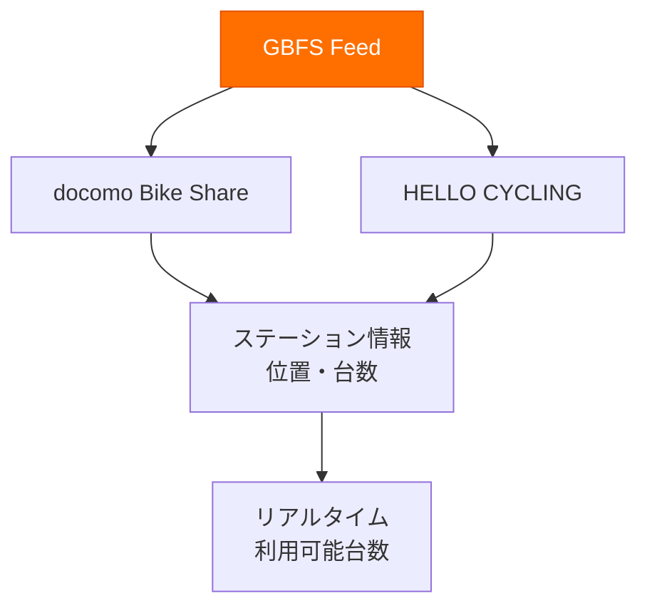

#### データ取得

```python
# docomo Bike Share
DOCOMO_FEED = "https://api-public.odpt.org/api/v4/gbfs/docomo-cycle-kyoto/station_information.json"

# HELLO CYCLING
HELLO_FEED = "https://api-public.odpt.org/api/v4/gbfs/hellocycling/station_information.json"

async def fetch_gbfs_stations(feed_url: str) -> list[Station]:
    """GBFS feedから利用可能なステーション取得"""
    async with httpx.AsyncClient() as client:
        response = await client.get(feed_url)
        data = response.json()

        return [
            Station(
                id=s['station_id'],
                name=s['name'],
                lon=s['lon'],
                lat=s['lat'],
                available_bikes=s.get('num_bikes_available', 0)
            )
            for s in data['data']['stations']
        ]
```

---

## 技術選定理由まとめ

### 1. パフォーマンス重視

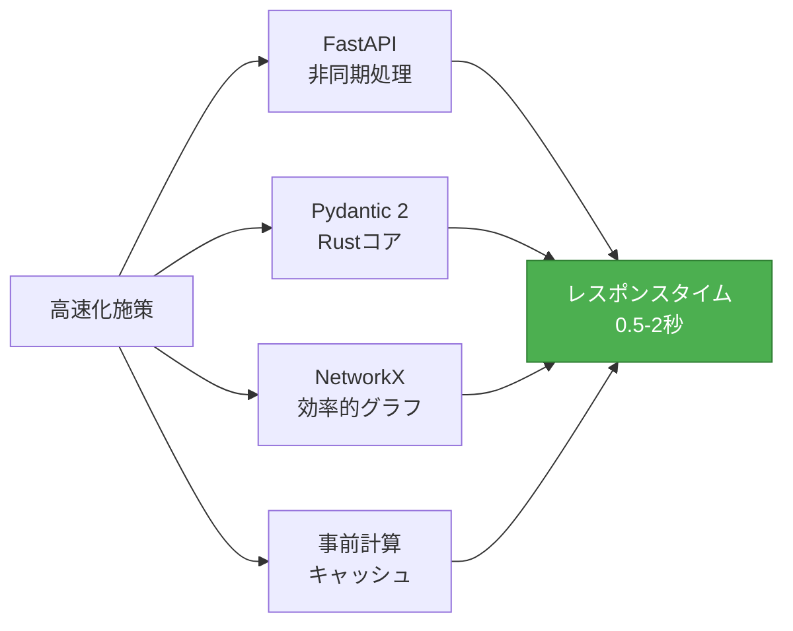

### 2. 開発速度重視

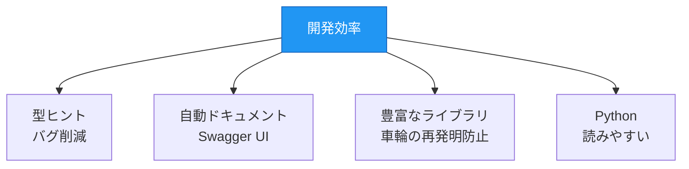

### 3. コスト最適化

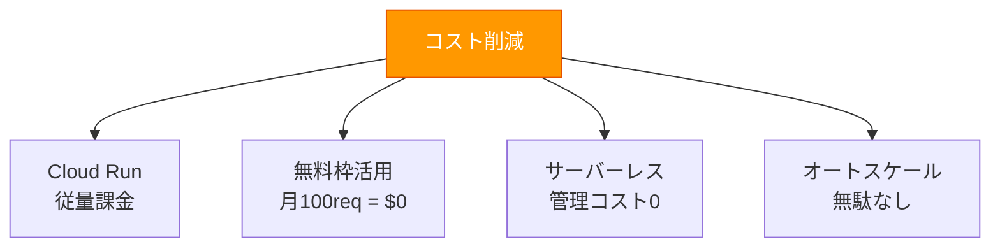

### 4. 拡張性・保守性

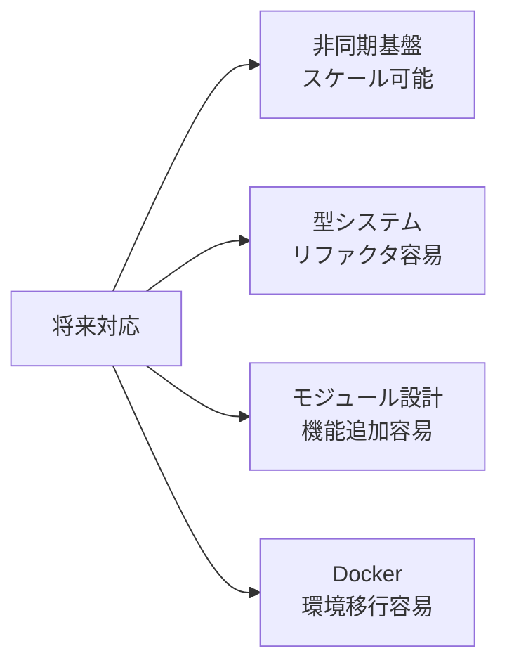

---

## アーキテクチャの利点

### 1. レイヤード アーキテクチャ

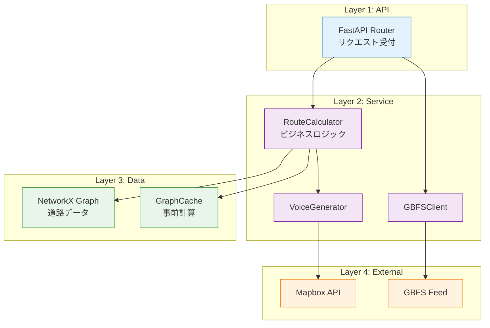

**利点**:
- **責務の分離**: 各レイヤーが独立
- **テスト容易**: モックで各層を分離テスト
- **変更容易**: 外部APIの切り替えが簡単

---

### 2. 依存性注入パターン

```python
# app.state を使ったDI（Dependency Injection）
@asynccontextmanager
async def lifespan(app: FastAPI):
    # 起動時に依存オブジェクトを生成
    app.state.graph = load_graph()
    app.state.route_calculator = RouteCalculator(app.state.graph)
    app.state.gbfs_client = GBFSClient()

    yield

# エンドポイントから利用
@app.get("/api/v1/route")
async def get_route(request: Request):
    # DIコンテナから取得
    calculator = request.app.state.route_calculator
    result = calculator.calculate_route(...)
```

**利点**:
- **シングルトン管理**: グラフデータは1つだけメモリに載る
- **テスト容易**: モックオブジェクトに差し替え可能
- **ライフサイクル制御**: 起動・終了処理を一元管理

---

### 3. 型安全設計

```python
from pydantic import BaseModel
from typing import Literal

# すべてのデータ構造が型付き
class RouteRequest(BaseModel):
    origin: tuple[float, float]
    destination: tuple[float, float]
    mode: Literal["my-cycle", "share-cycle"]
    safety: int  # 1-5

class RouteResult(BaseModel):
    coordinates: list[list[float]]
    distance: float
    duration: float
    safety_score: float

# 型エラーはコンパイル時に検出（mypy）
def calculate_route(req: RouteRequest) -> RouteResult:
    ...
```

**利点**:
- **バグ削減**: 型ミスはデプロイ前に検出
- **リファクタ安全**: IDEが自動で追跡
- **ドキュメント**: 型が仕様を表現

---

## まとめ: なぜこのスタックか

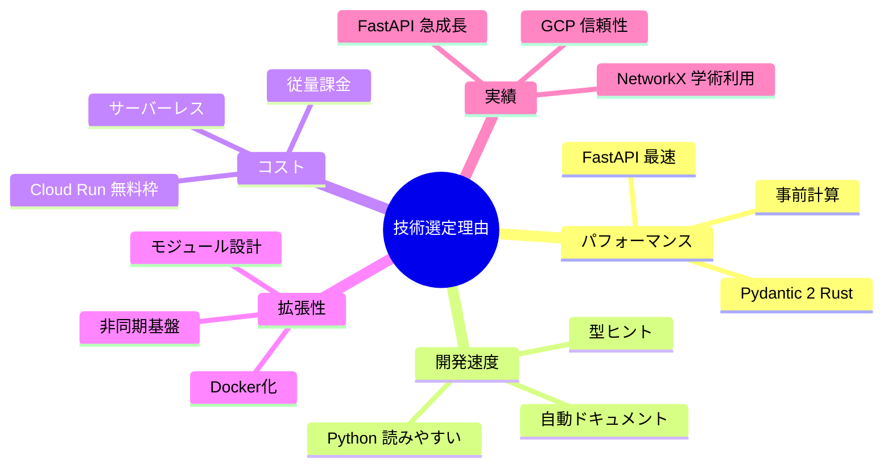

### 最終評価

| 観点 | 評価 | 詳細 |
|-----|------|------|
| **パフォーマンス** | ⭐⭐⭐⭐⭐ | 0.5-2秒レスポンス、並列処理 |
| **開発速度** | ⭐⭐⭐⭐⭐ | 型安全、自動ドキュメント |
| **コスト** | ⭐⭐⭐⭐⭐ | 月100req = $0、無料枠内 |
| **拡張性** | ⭐⭐⭐⭐ | 非同期、モジュール化 |
| **保守性** | ⭐⭐⭐⭐⭐ | レイヤード、型システム |
| **学習コスト** | ⭐⭐⭐⭐ | Python、豊富なドキュメント |

---

## 参考資料

- [FastAPI公式ドキュメント](https://fastapi.tiangolo.com/)
- [NetworkX Documentation](https://networkx.org/documentation/stable/)
- [Pydantic V2 Documentation](https://docs.pydantic.dev/latest/)
- [Google Cloud Run Documentation](https://cloud.google.com/run/docs)
- [GBFS Specification](https://github.com/MobilityData/gbfs)
- [Mapbox API Documentation](https://docs.mapbox.com/api/)
